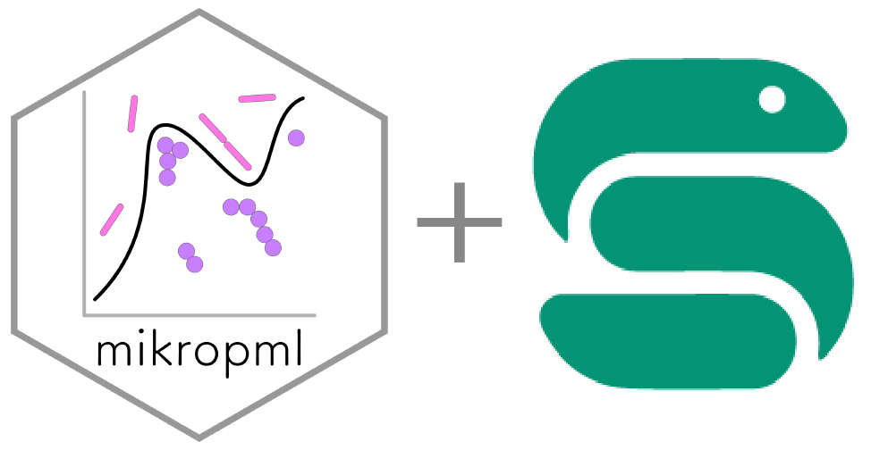

# Run mikropml with snakemake 

<!--[](https://github.com/SchlossLab/mikropml-snakemake-workflow/actions/workflows/tests.yml)-->
[](https://github.com/SchlossLab/mikropml-snakemake-workflow/actions/workflows/build.yml)
[](https://github.com/SchlossLab/mikropml-snakemake-workflow/actions/workflows/tests.yml)
[](/LICENSE.md)
[](https://zenodo.org/badge/latestdoi/292886119)

[Snakemake](https://snakemake.readthedocs.io/en/stable) is a workflow manager
that enables massively parallel and reproducible
analyses.
Snakemake is a suitable tool to use when you can break a workflow down into
discrete steps, with each step having input and output files.

[mikropml](http://www.schlosslab.org/mikropml/) is an R package for supervised machine learning pipelines.
We provide this example workflow as a template to get started running mikropml with snakemake.
We hope you then customize the code to meet the needs of your particular ML task.

For more details on these tools, see the
[Snakemake tutorial](https://snakemake.readthedocs.io/en/stable/tutorial/tutorial.html)
and read the [mikropml docs](http://www.schlosslab.org/mikropml/).

## The Workflow

The [`Snakefile`](workflow/Snakefile) contains rules which define the output files we want and how to make them.
Snakemake automatically builds a directed acyclic graph (DAG) of jobs to figure
out the dependencies of each of the rules and what order to run them in.
This workflow preprocesses the example dataset, calls `mikropml::run_ml()`
for each seed and ML method set in the config file,
combines the results files, plots performance results
(cross-validation and test AUROCs, hyperparameter AUROCs from cross-validation, and benchmark performance),
and renders a simple [R Markdown report](report.Rmd) as a GitHub-flavored markdown file ([see example here](report-example.md)).

<!-- Create the rulegraph with workflow/scripts/rulegraph.sh -->


The DAG shows how calls to `run_ml` can run in parallel if
snakemake is allowed to run more than one job at a time.
If we use 100 seeds and 4 ML methods, snakemake would call `run_ml` 400 times.
Here's a small example DAG if we were to use only 2 seeds and 1 ML method:

<!-- Create the dag with workflow/scripts/dag.sh -->


## Usage

Full usage instructions recommended by snakemake are [here](https://snakemake.github.io/snakemake-workflow-catalog/?usage=SchlossLab/mikropml-snakemake-workflow). This method uses `snakedeploy` to obtain this workflow.

### Quick Start

1. Obtain this repo with one of these methods:

  - clone:
    ``` sh
    git clone https://github.com/SchlossLab/mikropml-snakemake-workflow
    cd mikropml-snakemake-workflow
    ```
  - use this template:
    If you're viewing this on GitHub,
    you can click the green `Use this template` button to create
    your own version of the repo on GitHub, then clone it.
    

1. Install the dependencies.

    1. If you don't have conda yet, we recommend installing
       [miniconda](https://docs.conda.io/en/latest/miniconda.html).

    1. Next, install [mamba](https://mamba.readthedocs.io/en/latest/),
       a fast drop-in replacement for conda:

       ``` sh
       conda install mamba -n base -c conda-forge
       ```

    1. Create a conda environment with snakemake installed:

       ``` sh
       mamba env create -f workflow/envs/smk.yml
       conda activate smk
       ```

    - Alternatively, you can install the dependencies listed in
    [the conda environments](/workflow/envs/) however you like.

1. Edit the configuration file [`config/default.yml`](/config/default.yml).

1. Do a dry run to make sure the snakemake workflow is valid.

    ``` sh
    snakemake -n
    ```

1. Run the workflow.

    Run it **locally** using 2 cores:
    ``` sh
    snakemake --use-conda --cores 2
    ```

    Or specify a different config file:
    ``` sh
    snakemake --use-conda --cores 2 --configfile config/test.yml
    ```

    You can use singularity with:
    ``` sh
    snakemake --use-conda --use-singularity --cores 2
    ```

    Or submit the jobs to a slurm cluster:
    ```sh
    snakemake --profile config/slurm --use-conda --use-singularity --cores 2
    ```
    See the [slurm config instructions](config/README.dm#slurm) for more details
    on slurm configuration.

1. View the results in `report.md` ([see example here](report-example.md)).

    This example report was created by running the workflow on the Great Lakes HPC
    at the University of Michigan.

## Out of memory or walltime

When using slurm,
if any of your jobs fail because it ran out of memory, you can increase the
memory for the given rule with the
[resources directive](https://snakemake.readthedocs.io/en/stable/snakefiles/rules.html#resources)
in the Snakefile. For example, if the `combine_hp_performance` rule fails, you
can increase the memory from 16GB to say 24GB in
[workflow/rules/combine.smk](/workflow/rules/combine.smk):

```
rule combine_hp_performance:
    input:
        ...
    resources:
        mem_mb = MEM_PER_GB * 24
    ...
```

The new `mem_mb` value then gets passed on to the slurm configuration.

To specify more cores for a rule, use the
[threads directive](https://snakemake.readthedocs.io/en/stable/snakefiles/rules.html#threads):

```
rule combine_hp_performance:
    input:
        ...
    resources:
        mem_mb = MEM_PER_GB * 24
    threads: 8
    ...
```

You can also change other slurm parameters that are defined in
[config/slurm/config.yml](/config/slurm/config.yml)

## More resources

- [mikropml docs](http://www.schlosslab.org/mikropml/)
- [Snakemake tutorial](https://snakemake.readthedocs.io/en/stable/tutorial/tutorial.html)
- [conda user guide](https://docs.conda.io/projects/conda/en/latest/user-guide/getting-started.html)
