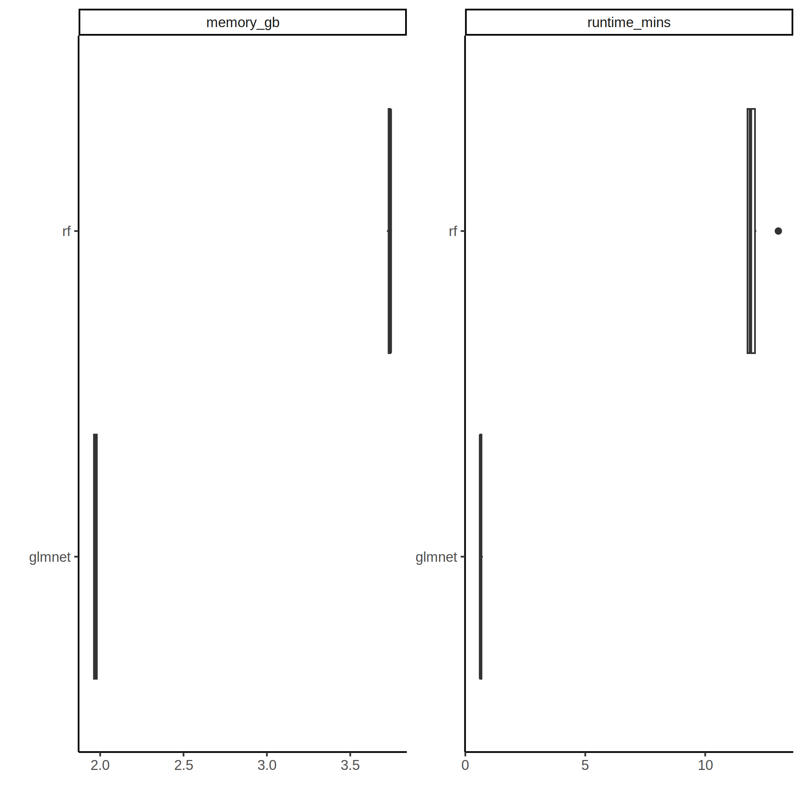

ML Results
================
2022-11-02

Machine learning algorithms used were glmnet and rf. Models were trained
with 10 different random partitions of the otu-large dataset into
training and testing sets using 5-fold cross validation.

## Model Performance

## Feature Importance

## Memory Usage & Runtime

Each model training run was given 8 cores for parallelization.

## Hyperparameter Performance

