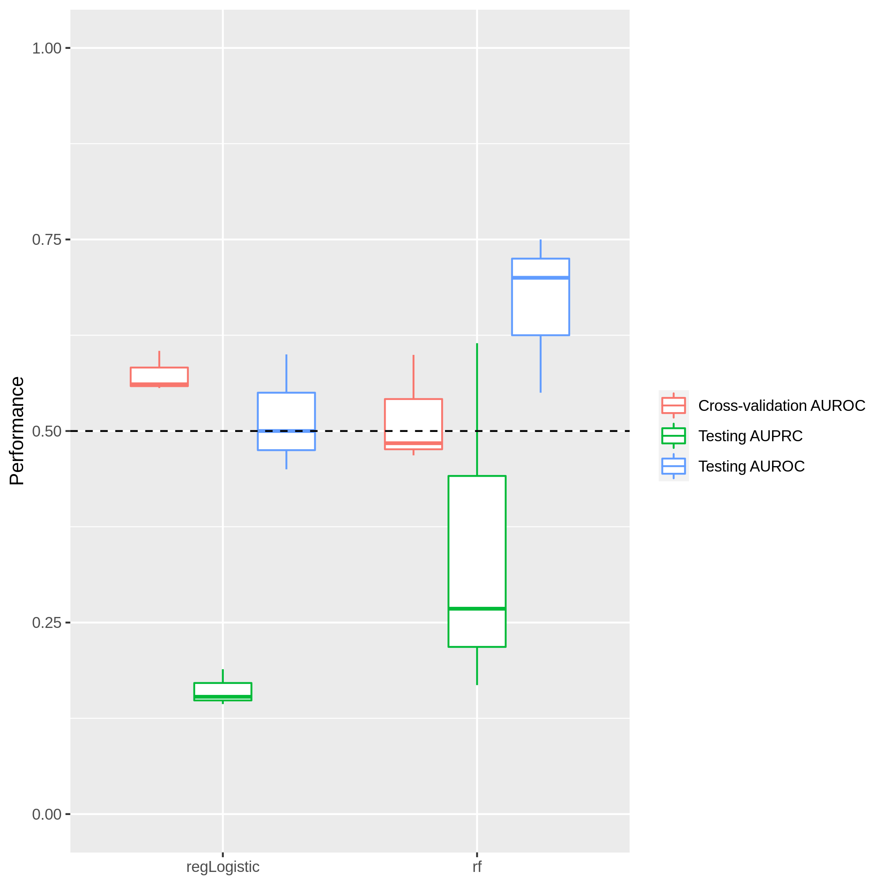

ML Results
================
2020-10-02

Machine learning algorithms used include: rf, regLogistic. Models were
trained with 2 different random partitions of the data into training and
testing sets.

Model Performance
-----------------

<!-- -->
