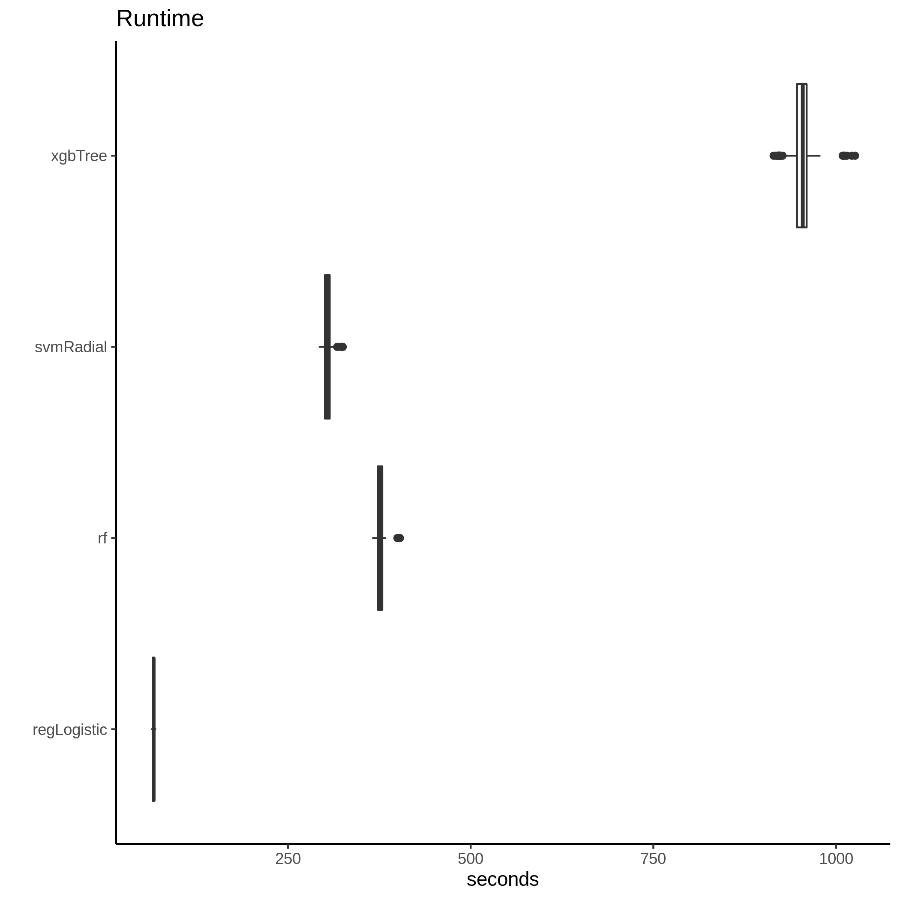

ML Results
================
2020-10-08

Machine learning algorithms used include: rf, regLogistic, svmRadial,
xgbTree. Models were trained with 100 different random partitions of the
data into training and testing sets.

Model Performance
-----------------

<!-- -->

Runtime
-------

<!-- -->
